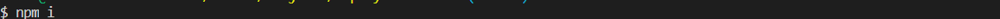

# Employee-Directory
This is a fitness tracker app it is used to track your fitness like no sets, km run, sets done, type of excercise etc.

## Installation
Git clone the repo on your local computer and write npm i in Git bash shell.

## Usage 
Go to open Bash 

Do NPM i & press enter

Do npm start & press enter

Main page

Click name to sort data by name

Sorted

write name or some letters to narrow down search results

